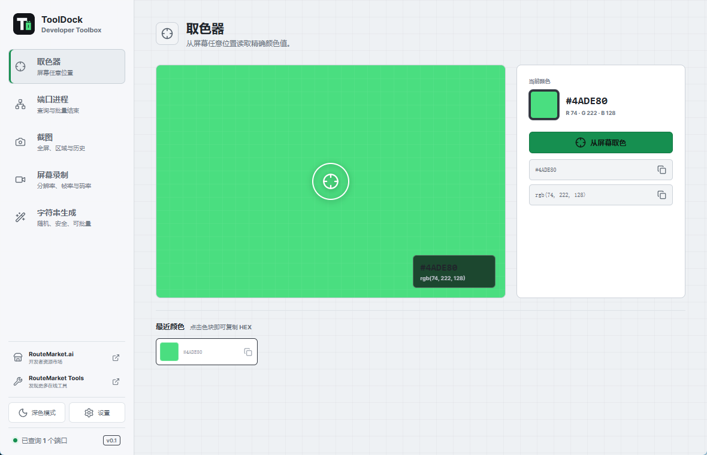
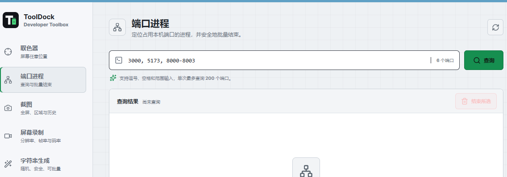
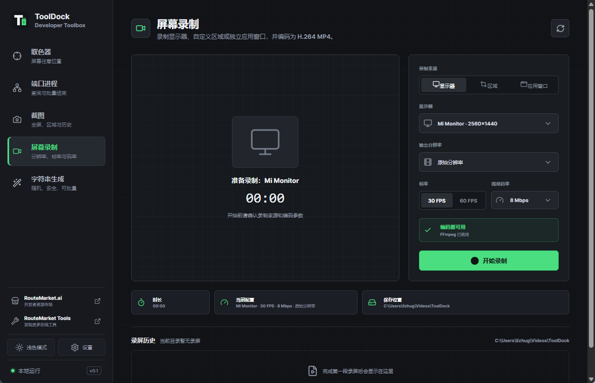

# ToolDock

**A local desktop toolbox for everyday developer work.**

**English** | [简体中文](README.zh-CN.md) | [日本語](README.ja.md)

ToolDock brings color picking, port process management, screenshots, screen recording, and secure string generation into one desktop app. It works on Windows, macOS, and Linux, requires no account, and keeps your working data on your computer.

## Download

[**Download the latest ToolDock release**](../../releases/latest)

Choose the package for your system:

| System | Package | Notes |
| --- | --- | --- |
| Windows x64 | NSIS `.exe` | Standard installer with Start menu and uninstall entries |
| macOS Apple Silicon | `.dmg` | For M1 and newer Macs |
| macOS Intel | `.dmg` | For Intel-based Macs |
| Linux x64 | `.AppImage` | Portable; no installation required |
| Debian / Ubuntu x64 | `.deb` | Installs through the system package manager |

Early releases may not be code-signed. Your operating system may ask you to confirm that you trust the application before opening it.

## What You Can Do

- **Pick colors anywhere on screen** with a cross-display overlay and cursor-following magnifier. The selected color is copied automatically.
- **Find processes by port** using individual ports or ranges, then terminate selected processes after confirmation.
- **Capture screenshots** from a full display or a freely selected region. Images are saved, copied to the clipboard, and added to capture history.
- **Record your screen** by display, region, or application window with a live preview, configurable resolution, frame rate, bitrate, and optional microphone audio.
- **Generate secure strings** including alphanumeric values, numbers, HEX strings, symbols, and UUID v4 values.
- **Work your way** with light and dark themes, four interface languages, configurable fonts, global shortcuts, storage folders, and system tray behavior.

  
  

## Quick Start

1. Install ToolDock, or launch the Linux AppImage.
2. Open **Settings** to choose your language, font, screenshot folder, and recording folder.
3. Select a tool from the sidebar.
4. Keep ToolDock available from the system tray, or use a global shortcut without opening the main window.

ToolDock supports Simplified Chinese, English, Japanese, and Korean in the application.

## Color Picker

1. Open **Color Picker** and select **Pick from screen**.
2. ToolDock hides its window and places a dimmed overlay across all displays.
3. Move the pointer to inspect pixels through the magnifier.
4. Click to select a color, or press `Esc` to cancel.
5. The selected value is copied automatically. HEX and RGB values remain available in recent history.

Only one magnifier is shown, following the pointer across multiple displays.

## Port Process Manager

1. Open **Port Processes**.
2. Enter ports separated by commas or spaces, or enter a range such as `8000-8010`.
3. Select **Search**.
4. Review the process name, PID, state, command, and memory usage.
5. Select one or more results, choose **Terminate selected**, and confirm.

Recent port queries are retained between refreshes. Protected or elevated processes can only be terminated when ToolDock has matching privileges. Always verify the PID before terminating a process.

## Screenshots

1. Open **Screenshot**.
2. Choose **Full display** or **Select region**.
3. Select a display and, if needed, a capture delay.
4. For a region capture, drag across the dimmed desktop overlay to define the area.
5. The PNG image is saved and copied to the clipboard, ready to paste into another application.
6. Open previous captures from the history below the capture controls.

Screenshots are saved to `Pictures/ToolDock` by default. You can change the folder in **Settings**.

## Screen Recording

Screen recording requires [FFmpeg](https://ffmpeg.org/).

1. Install FFmpeg and make sure `ffmpeg` is available on `PATH`.
2. Open **Screen Recording**.
3. Choose a display, selected region, or application window.
4. Set the output resolution, frame rate, and bitrate.
5. Enable **Record audio** and choose an input device when microphone or audio-input recording is needed.
6. Select **Start recording** to view the capture in the live preview.
7. Select **Stop and save**. The MP4 file appears in recording history and can be played from ToolDock.

Recordings are saved to `Videos/ToolDock` by default. To use FFmpeg from a custom location, set `TOOLDOCK_FFMPEG` to the full executable path before starting ToolDock.

ToolDock searches for FFmpeg in this order:

1. The `TOOLDOCK_FFMPEG` environment variable
2. `ffmpeg` on `PATH`
3. Common executable locations beside the application

All other tools work without FFmpeg.

## String Generator

1. Open **String Generator**.
2. Choose alphanumeric, letters, numbers, HEX, or UUID v4.
3. Set the length and number of results.
4. Enable symbols when needed.
5. Generate and copy one result or all results.

## Settings And Shortcuts

Open **Settings** to configure:

- Interface language and font
- Screenshot and recording folders
- Global shortcuts
- Close the app or keep it running in the system tray

Default global shortcuts:

| Action | Windows / Linux | macOS |
| --- | --- | --- |
| Pick a color | `Ctrl+Alt+C` | `Command+Option+C` |
| Capture a region | `Ctrl+Alt+S` | `Command+Option+S` |
| Start or stop recording | `Ctrl+Alt+R` | `Command+Option+R` |

Shortcuts can be changed in **Settings**. Each action must use a different key combination.

## Platform Permissions

- **Windows:** WebView2 is required. Terminating administrator processes may require running ToolDock as administrator.
- **macOS:** Color picking, screenshots, and recording require Screen Recording permission. Color picking may also require Input Monitoring permission. Audio recording requires microphone permission.
- **Linux:** X11 provides the broadest capture support. Wayland behavior depends on the compositor and desktop portal. Recording may require PipeWire and appropriate desktop permissions.

## Troubleshooting

**Screen recording says FFmpeg is missing**

Run `ffmpeg -version` in a terminal. If the command is unavailable, add FFmpeg to `PATH` or set `TOOLDOCK_FFMPEG`, then restart ToolDock.

**A global shortcut does not work**

Choose another shortcut in **Settings**. Another application or the operating system may already be using the same combination.

**ToolDock cannot terminate a process**

The process may be protected or running with higher privileges. Restart ToolDock with matching privileges and verify the PID before trying again.

**Capture features do not work on macOS or Linux**

Check the operating-system screen capture permissions. On Wayland, support can vary by desktop environment and portal configuration.

## Privacy

ToolDock processes screenshots, recordings, colors, process information, and generated strings locally. It does not require an account or upload this data to a ToolDock service.

The sidebar contains optional links to RouteMarket.ai and RouteMarket Tools. These links open in your default browser and include UTM campaign parameters; opening them does not upload data from ToolDock.

## Contributing

Bug reports and pull requests are welcome. Read [CONTRIBUTING.md](CONTRIBUTING.md) before contributing. Developers who want to build ToolDock from source can find the required commands there and in [the release guide](docs/RELEASING.md).

Please report security issues privately according to [SECURITY.md](SECURITY.md).

ToolDock is released under the [MIT License](LICENSE).
