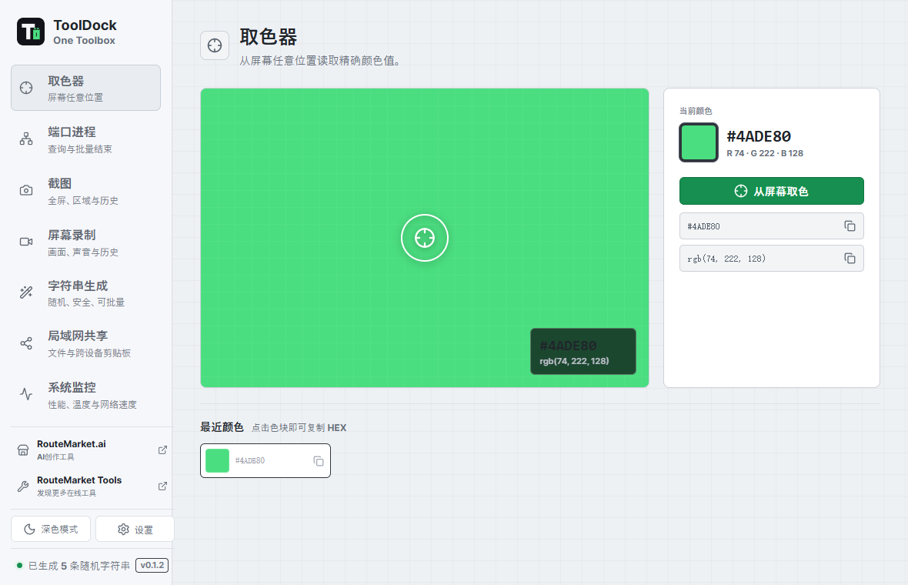
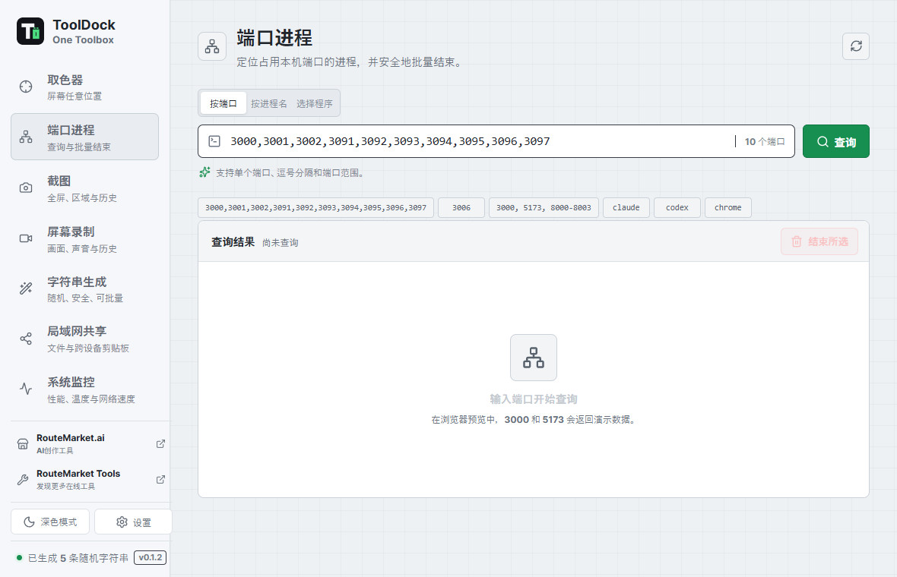
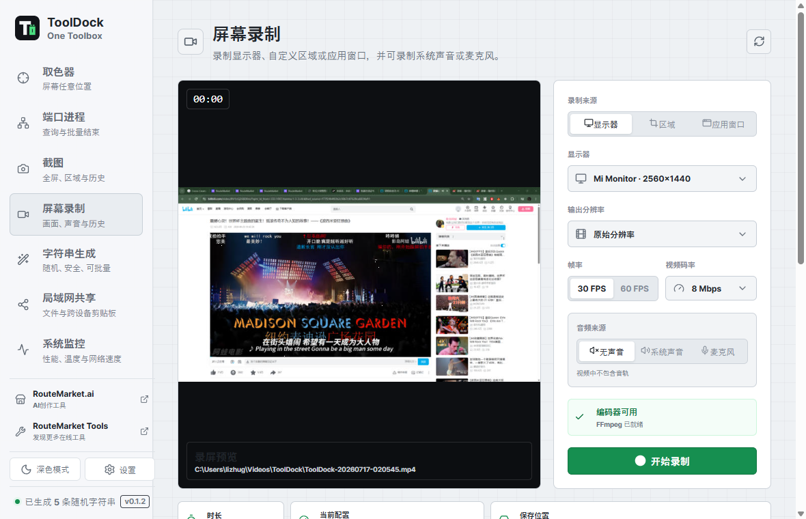

# ToolDock

**为日常开发工作准备的本地桌面工具箱。**

[English](README.md) | **简体中文** | [日本語](README.ja.md)

ToolDock 将屏幕取色、端口进程管理、截图、录屏、安全字符串生成和局域网共享集中在一个桌面应用中。它支持 Windows、macOS 和 Linux，无需注册账号，工作数据保留在你的电脑上。

## 下载

[**下载最新版本 ToolDock**](../../releases/latest)

请根据系统选择安装包：

| 系统 | 安装包 | 说明 |
| --- | --- | --- |
| Windows x64 | NSIS `.exe` | 标准安装程序，包含开始菜单和卸载入口 |
| macOS Apple Silicon | `.dmg` | 适用于 M1 及更新的 Mac |
| macOS Intel | `.dmg` | 适用于 Intel Mac |
| Linux x64 | `.AppImage` | 便携版，无需安装 |
| Debian / Ubuntu x64 | `.deb` | 通过系统包管理器安装 |

早期版本可能尚未进行代码签名。首次打开时，操作系统可能要求你确认是否信任此应用。

## 主要功能

- **屏幕取色**：通过跨屏遮罩和跟随鼠标的放大镜查看像素，选中的颜色会自动复制。
- **端口进程管理**：查询单个端口或端口范围，确认后批量结束所选进程。
- **截图**：截取完整显示器或自由框选区域，图片会保存到本地、复制到剪贴板并加入截图历史。
- **屏幕录制**：录制显示器、指定区域或应用窗口，支持实时预览、分辨率、帧率、码率和可选的麦克风声音。
- **安全字符串生成**：生成字母数字、纯数字、HEX、符号组合和 UUID v4。
- **局域网共享**：发现附近的 ToolDock 设备，批量传输文件，并跨设备同步文本剪贴板。
- **个性化设置**：支持深浅色主题、四种界面语言、自定义字体、全局快捷键、媒体文件夹和系统托盘。

  
  

## 快速开始

1. 安装 ToolDock，Linux 用户也可以直接运行 AppImage。
2. 打开“设置”，选择界面语言、字体、截图文件夹和录屏文件夹。
3. 从侧栏选择需要使用的工具。
4. 将 ToolDock 保留在系统托盘中，或通过全局快捷键直接调用常用功能。

应用界面支持简体中文、英文、日文和韩文。

## 屏幕取色

1. 打开“取色器”，点击“从屏幕取色”。
2. ToolDock 会隐藏主窗口，并在所有显示器上显示半透明暗色遮罩。
3. 移动鼠标，通过跟随鼠标的放大镜查看像素。
4. 单击选择颜色，或按 `Esc` 取消。
5. 色值会自动复制到剪贴板，HEX 和 RGB 也会保留在最近记录中。

多显示器环境中只会显示一个放大镜，并跟随鼠标移动到当前屏幕。

## 端口进程管理

1. 打开“端口进程”。
2. 输入用逗号或空格分隔的端口，也可以输入 `8000-8010` 这样的范围。
3. 点击“查询”。
4. 检查进程名、PID、状态、启动命令和内存占用。
5. 勾选一个或多个结果，点击“结束所选”并确认。

最近查询过的端口会持续保留，不会因刷新丢失。受保护或以更高权限运行的进程，需要 ToolDock 具备相同权限才能结束。操作前请仔细核对 PID。

## 截图

1. 打开“截图”。
2. 选择“完整显示器”或“选择区域”。
3. 选择显示器，并按需设置延时。
4. 区域截图时，在暗色桌面遮罩上拖动鼠标框选范围。
5. PNG 图片会保存到本地并自动复制到剪贴板，可直接粘贴到其他应用。
6. 在操作区下方的截图历史中打开之前的图片。

截图默认保存到 `图片/ToolDock`，可在“设置”中修改文件夹。

## 屏幕录制

正式发布的安装包会包含经过校验的 FFmpeg sidecar，用户不需要另外安装 FFmpeg。

1. 打开“屏幕录制”。
2. 选择显示器、自定义区域或应用窗口。
3. 设置输出分辨率、帧率和码率。
4. 需要录音时，开启“录制声音”并选择音频输入设备。
5. 点击“开始录制”，在实时预览中查看当前画面。
6. 点击“停止并保存”，MP4 文件会出现在录屏历史中，可直接在 ToolDock 内播放。

录屏默认保存到 `视频/ToolDock`，可在“设置”中修改文件夹。开发者如需覆盖内置 FFmpeg，可以在启动 ToolDock 前将 `TOOLDOCK_FFMPEG` 设置为 FFmpeg 可执行文件的完整路径。

ToolDock 会按以下顺序查找 FFmpeg：

1. `TOOLDOCK_FFMPEG` 环境变量
2. ToolDock 安装包内经过校验的 sidecar
3. `PATH` 中的 `ffmpeg`

FFmpeg 作为独立的第三方可执行文件按其自身许可证分发，构建与源码信息请查看[第三方组件声明](THIRD_PARTY_NOTICES.md)。

## 字符串生成

1. 打开“字符串生成”。
2. 选择字母数字、仅字母、仅数字、HEX 或 UUID v4。
3. 设置长度和生成数量。
4. 按需开启符号。
5. 生成后复制单条结果或全部结果。

## 局域网共享

ToolDock 可以发现同一局域网内的其他 ToolDock 设备，不需要账号，也不经过云端中转。

1. 在两台设备上打开“局域网共享”。
2. 选择附近设备，输入对方界面上显示的连接密码。
3. 选择一个或多个文件发送，或立即发送当前文本剪贴板。
4. 需要持续同步时，开启“自动同步剪贴板”；任一已连接设备复制的新文本会自动发送。
5. 在文件传输历史和剪贴板历史中查看发送与接收记录。

首次启动会自动生成一个随机六位连接密码。可以在“设置”中修改密码；密码至少需要 4 个字符，也可以留空进入免密码开放模式。密码不会包含在设备发现广播中，文件和剪贴板内容会在已连接设备之间加密传输。连接只在本次 ToolDock 运行期间保持。

接收文件默认保存到 `Downloads/ToolDock/Received`。可以在“设置”中修改接收目录、设备名称、连接密码，或完全关闭局域网共享。当前版本仅同步文本剪贴板，不会同步剪贴板图片或富文本。

## 设置与快捷键

打开“设置”可以配置：

- 界面语言和字体
- 截图与录屏保存文件夹
- 局域网设备名称、连接密码和文件接收目录
- 全局快捷键
- 关闭程序或继续在系统托盘运行

默认全局快捷键：

| 操作 | Windows / Linux | macOS |
| --- | --- | --- |
| 屏幕取色 | `Ctrl+Alt+C` | `Command+Option+C` |
| 区域截图 | `Ctrl+Alt+S` | `Command+Option+S` |
| 开始或停止录屏 | `Ctrl+Alt+R` | `Command+Option+R` |

快捷键可以在“设置”中修改，三个功能不能使用相同的组合键。

## 系统权限

- **Windows**：需要 WebView2。结束管理员进程时，可能需要以管理员身份运行 ToolDock。
- **macOS**：取色、截图和录屏需要“屏幕录制”权限；取色还可能需要“输入监控”权限；录制声音需要麦克风权限；局域网共享需要“本地网络”权限。
- **Linux**：X11 的捕获支持最完整。Wayland 下的可用性取决于桌面环境、合成器和 Portal；录屏可能还需要 PipeWire 和相应的桌面权限。

## 常见问题

**录屏提示找不到 FFmpeg**

请从官方 GitHub Release 重新安装 ToolDock，正式安装包已经包含 FFmpeg。使用自定义开发构建时，可以运行 `npm run prepare:ffmpeg`，或设置 `TOOLDOCK_FFMPEG` 后重启 ToolDock。

**全局快捷键没有反应**

在“设置”中更换组合键。当前快捷键可能已经被其他应用或操作系统占用。

**无法结束某个进程**

该进程可能受到系统保护或使用了更高权限。请以相同权限重新运行 ToolDock，并再次核对 PID。

**macOS 或 Linux 无法使用取色、截图或录屏**

请检查系统的屏幕捕获权限。Wayland 的支持情况会随桌面环境和 Portal 配置而变化。

**发现不到另一台 ToolDock 设备**

确认两台设备连接到同一局域网、都已启用局域网共享，并允许 ToolDock 通过操作系统的专用网络防火墙。访客 Wi-Fi 或开启了客户端隔离的网络可能会阻止设备发现。

**局域网连接被拒绝**

请重新输入接收设备当前显示的密码。修改密码会重启局域网共享，并断开已有连接。

## 隐私

ToolDock 在本地处理截图、录屏、色值、进程信息、生成的字符串、传输文件和同步的剪贴板文本，不需要账号，也不会将这些数据上传到 ToolDock 服务。局域网共享会在你的网络内由设备直接通信。

侧栏包含可选的 RouteMarket.ai 和 RouteMarket Tools 链接。链接会在默认浏览器中打开并携带 UTM 活动参数，但不会上传 ToolDock 中的数据。

## 参与贡献

欢迎提交问题和 Pull Request。参与开发前请阅读 [CONTRIBUTING.md](CONTRIBUTING.md)。需要从源码构建 ToolDock 的开发者，可在贡献指南和[发布说明](docs/RELEASING.md)中查看环境与命令。

安全问题请按照 [SECURITY.md](SECURITY.md) 私下报告。

ToolDock 基于 [MIT License](LICENSE) 开源。
